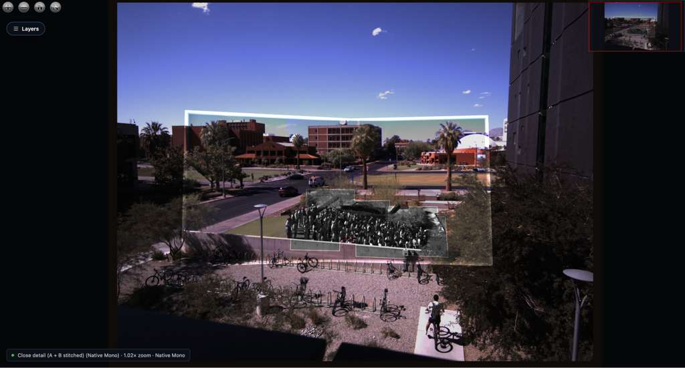
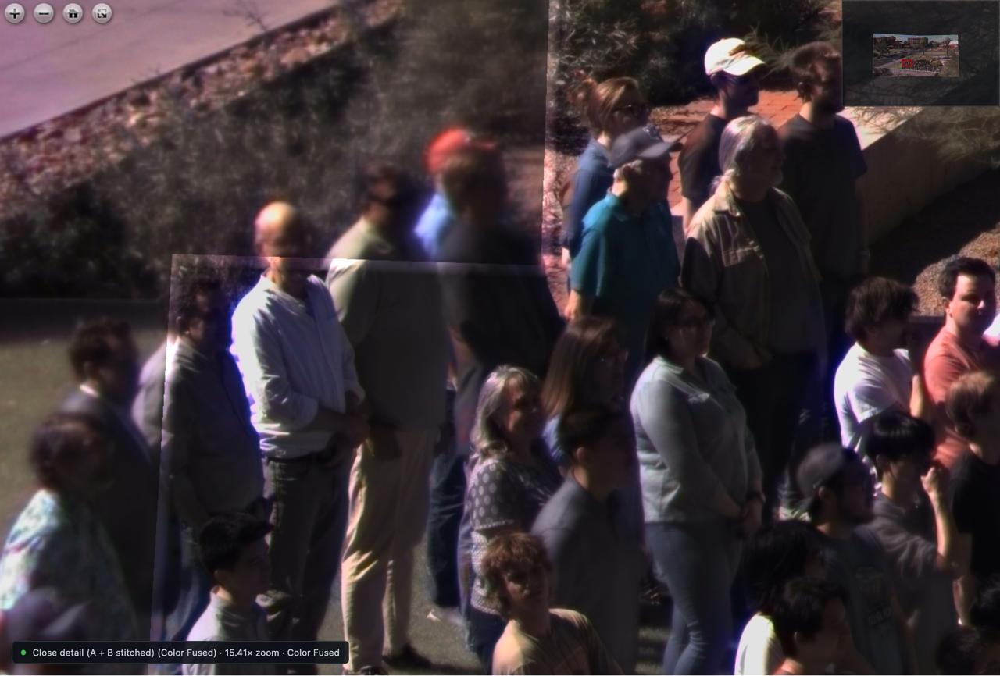

# Multiscale Viewer

Interactive, multi-scale deep zoom viewer for the department camera array, registered into a unified coordinate frame.

**Live Interactive Web Viewer (GitHub Pages):**
- [https://gord123098.github.io/department-photo/](https://gord123098.github.io/department-photo/)

**Repositories (Auto-Synchronized):**
- [https://github.com/Gord123098/department-photo](https://github.com/Gord123098/department-photo)
- [https://github.com/arizonaCameraLab/department-photo](https://github.com/arizonaCameraLab/department-photo)

---

## Multi-Scale Demonstration


*Multi-scale registration showing the wide color context frame (8FF9), 12 mm stitched tier footprint, and high-resolution close detail (A + B) telephoto array over the crowd.*

### Telephoto Sampling Boundary

*Deep zoom crop (15.41×) capturing the transition boundary where the high-resolution monochrome telephoto array has sampled vs. the outer wide context.*

---

## Credits & Acknowledgments

- **Heterogeneous Camera Array**: Based on the processing pipeline and camera registration architecture from the [Arizona Camera Lab](https://github.com/arizonaCameraLab).
- **Upstream Repository**: [arizonaCameraLab/Heterogeneous-Camera-Array](https://github.com/arizonaCameraLab/Heterogeneous-Camera-Array)
- **Author & Original Viewer**: Special credit to **Adel** ([@adel111700](https://github.com/adel111700)) for authoring the heterogeneous camera array pipeline and original viewer.

---

## Keyboard Shortcuts

| Key | Action |
| :--- | :--- |
| <kbd>[</kbd> / <kbd>]</kbd> | Put away / Toggle Sidebar Menu |
| <kbd>E</kbd> | Cycle through Telephoto Field Edges (`Left` → `Right` → `Top` → `Bottom` → `Center`) |
| <kbd>M</kbd> / <kbd>F</kbd> | Toggle representation (**Color Fused** ⇄ **Native Mono**) |
| <kbd>0</kbd> | Auto Zoom Mode (focal tier switches dynamically on scroll) |
| <kbd>1</kbd> | Wide Color Panorama (8FF9) |
| <kbd>2</kbd> | 12 mm Stitched Array (6450 + 643D) |
| <kbd>3</kbd> | Close Detail A + B Stitched Array (6 cameras) |
| <kbd>4</kbd> | All-Monochrome Array |
| <kbd>Space</kbd> | Reset viewport to full panoramic frame |

---

## Local Development & Offline Viewing

```bash
# Serve locally
python3 serve_viewer.py

# Open in browser
http://127.0.0.1:8765/
```
